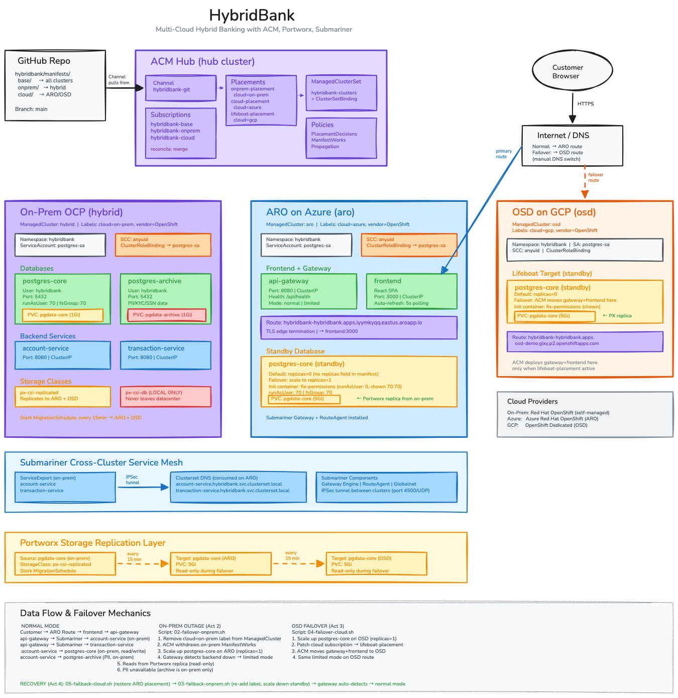

# HybridBank — Multi-Cloud Hybrid Banking with ACM, ArgoCD, Portworx & Submariner

A production-grade hybrid cloud demo deploying **HybridBank** across three OpenShift clusters using Red Hat Advanced Cluster Management, ArgoCD ApplicationSets, Portworx DR, and Submariner cross-cluster networking.



## Clusters

| Cluster | Platform | Role | ACM Name |
|---------|----------|------|----------|
| **OCP** | On-Premises (self-managed) | Hub + databases + backend services | `prem` |
| **ARO** | Azure Red Hat OpenShift | Frontend + API gateway + standby DB | `aro` |
| **OSD** | OpenShift Dedicated (GCP) | Lifeboat / failover target | `osd` |

## Technology Stack

| Layer | Technology | Purpose |
|-------|-----------|---------|
| Cluster management | ACM 2.x | ManagedClusterSet, Placements, governance policies |
| GitOps | ArgoCD ApplicationSets | Deploy manifests from Git to spoke clusters |
| Cross-cluster networking | Submariner + Globalnet | IPsec tunnels, clusterset DNS for service discovery |
| Storage replication | Portworx Enterprise + Stork | ClusterPairs, MigrationSchedules (every 15 min) |
| Data sovereignty | Gatekeeper + ACM Policy | PII-labeled deployments blocked on unrestricted clusters |
| Automation | Ansible + Terraform | End-to-end provisioning and configuration |

## Application — HybridBank

A multi-tier banking application demonstrating graceful degradation and data sovereignty:

| Component | Cluster | Purpose |
|-----------|---------|---------|
| `postgres-core` | On-prem (primary) | Account balances, recent transactions |
| `postgres-archive` | On-prem only | PII data (SSN, KYC) — never leaves datacenter |
| `account-service` | On-prem | Business logic, exported via Submariner |
| `transaction-service` | On-prem | Transaction processing, exported via Submariner |
| `api-gateway` | ARO | REST API, detects limited mode when backends down |
| `frontend` | ARO | React SPA, auto-refreshes status every 5s |
| `postgres-core` (standby) | ARO + OSD | Portworx replica, scaled up during failover |

## Quick Start

### 1. Provision clusters (Terraform)

```bash
cd terraform
cp terraform.tfvars.example terraform.tfvars   # fill in credentials
terraform init && terraform apply
```

### 2. Deploy everything (Ansible)

```bash
cd ansible
# Set credentials via environment or local secrets files
export PX_OBJECTSTORE_ACCOUNT=your_storage_account
export PX_OBJECTSTORE_KEY=your_storage_key
export AZURE_CLIENT_ID=... AZURE_CLIENT_SECRET=... AZURE_TENANT_ID=...
export GCP_SA_JSON='{"type": "service_account", ...}'

ansible-playbook site.yml
```

The master playbook runs 6 stages in order:

| Stage | Playbook | What it does |
|-------|----------|-------------|
| 1 | `01-cluster-config.yml` | Namespaces, StorageClasses, RBAC, cluster labels |
| 2 | `02-acm.yml` | Install ACM operator + MultiClusterHub |
| 3 | `03-acm-import.yml` | Import ARO + OSD as ManagedClusters |
| 4 | `03a-argocd.yml` | ArgoCD cluster secrets, Placements, ApplicationSets |
| 5 | `04-submariner.yml` | Submariner on all clusters + Azure LB rules |
| 6 | `05-portworx.yml` | Portworx install on all clusters |
| 7 | `06-portworx-dr.yml` | ClusterPairs, objectstore creds, MigrationSchedules |

### 3. Run the demo

```bash
cd hybridbank/scripts
./01-deploy-argocd.sh           # Verify ArgoCD deployment
./02-failover-onprem.sh         # Simulate on-prem outage
./03-failback-onprem.sh         # Restore on-prem
./04-failover-cloud.sh          # ARO → OSD lifeboat
./05-failback-cloud.sh          # Restore ARO
```

## Demo Scenarios

### Normal Mode
Frontend on ARO connects to on-prem backends via Submariner. Full PII visible, transfers enabled.

### On-Prem Outage (Act 2)
Remove on-prem label → ACM withdraws workloads → gateway detects backend down → **limited mode**: balances from Portworx replica (read-only), PII hidden (data sovereignty), transfers disabled.

### Cloud Failover (Act 3)
ARO goes down → ACM lifeboat placement moves frontend+gateway to OSD → same limited mode, app survives losing 2 of 3 clusters.

### Recovery (Act 4)
Restore labels → ACM redeploys → gateway detects backends → **full mode** restored automatically.

## Project Structure

```
.
├── ansible/
│   ├── site.yml                    # Master playbook
│   ├── playbooks/                  # 01 through 06
│   ├── roles/
│   │   ├── cluster-config/         # Namespaces, SC, labels, RBAC
│   │   ├── acm/                    # ACM operator install
│   │   ├── acm-import/             # Register managed clusters
│   │   ├── argocd/                 # GitOps setup + ApplicationSets
│   │   ├── submariner/             # Cross-cluster networking + Azure LB
│   │   ├── portworx/               # PX install (per-cloud templates)
│   │   └── portworx-dr/            # ClusterPairs, migrations, objectstore
│   └── inventory/
│       ├── hosts.yml               # Cluster definitions
│       ├── group_vars/             # Shared config
│       └── host_vars/              # Per-cluster credentials (gitignored)
├── terraform/
│   ├── aro/                        # ARO cluster module
│   ├── osd/                        # OSD cluster module
│   └── vpn/                        # Optional IPsec mesh VPN
├── hybridbank/
│   ├── argocd/                     # ApplicationSet definitions
│   ├── manifests/
│   │   ├── base/                   # Common resources (all clusters)
│   │   ├── onprem/                 # On-prem: databases, backend services, Stork
│   │   └── cloud/                  # Cloud: gateway, frontend, standby DB
│   ├── acm/                        # Governance policies (PII, Gatekeeper)
│   └── scripts/                    # Demo automation (01-05)
├── docs/                           # Architecture and operational docs
├── .gitignore
└── README.md
```

## Documentation Index

| Document | Description |
|----------|-------------|
| **Architecture** | |
| [`docs/architecture-diagram.png`](docs/architecture-diagram.png) | Full architecture diagram (PNG) |
| [`docs/architecture-diagram.svg`](docs/architecture-diagram.svg) | Full architecture diagram (SVG) |
| [`docs/architecture-diagram.excalidraw`](docs/architecture-diagram.excalidraw) | Editable source (Excalidraw) |
| **Demo Runbooks** | |
| [`hybridbank/DEMO-RUNBOOK.md`](hybridbank/DEMO-RUNBOOK.md) | Part 1: Manual failover/failback with ArgoCD + ACM Placements |
| [`hybridbank/DEMO-RUNBOOK-PART2.md`](hybridbank/DEMO-RUNBOOK-PART2.md) | Part 2: Intelligent automated placement (Steady prioritizer, Gatekeeper) |
| [`docs/demo-runbook.md`](docs/demo-runbook.md) | Demo narrative — what to say, what to show, talking points |
| **Operational Guides** | |
| [`docs/storage-replication-infrastructure.md`](docs/storage-replication-infrastructure.md) | Portworx replication setup: ClusterPairs, SchedulePolicy, MigrationSchedules |
| [`docs/portworx-cross-cloud-connectivity.md`](docs/portworx-cross-cloud-connectivity.md) | PX cross-cloud troubleshooting: TLS, auth, networking, Submariner |
| **Infrastructure** | |
| [`terraform/vpn/README.md`](terraform/vpn/README.md) | Three-site IPsec mesh VPN (Azure/GCP/On-Prem) via Terraform |

## Credentials

All secrets are externalized — no credentials are committed to git.

| Secret | How to provide |
|--------|---------------|
| Azure SP (Portworx on ARO) | `AZURE_CLIENT_ID`, `AZURE_CLIENT_SECRET`, `AZURE_TENANT_ID` env vars or `ansible/inventory/host_vars/aro-secrets.yml` |
| GCP SA key (Portworx on OSD) | `GCP_SA_JSON` env var or `ansible/inventory/host_vars/osd-secrets.yml` |
| PX objectstore (DR replication) | `PX_OBJECTSTORE_ACCOUNT`, `PX_OBJECTSTORE_KEY` env vars or `ansible/inventory/group_vars/secrets.yml` |
| Terraform vars | `terraform/terraform.tfvars` (from `.tfvars.example`) |

## Prerequisites

- OpenShift CLI (`oc`) with kubeconfigs for all clusters
- Ansible 2.14+ with `kubernetes.core` collection
- Terraform 1.5+
- Azure CLI (`az`) — for ARO NSG/LB automation
- `gcloud` CLI — for OSD setup
